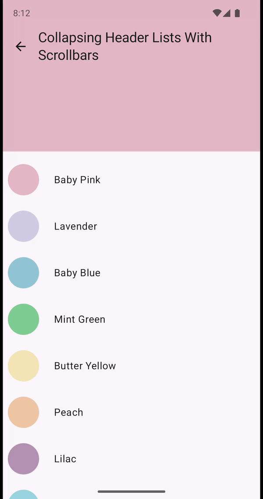

 # Collapsing Header

Collapsing headers in the library are achieved with a wrapping Composable enclosing a scrollable
layout.

```kotlin
@Composable
fun CollapsingHeader(
    state: CollapsingHeaderState,
    headerContent: @Composable () -> Unit,
    body: @Composable () -> Unit,
) {
    ...
}
```

It works with any layout in the body composable that supports nested scrolling.

| Composable          |                                                                                                          |                                                                                                          |                                                                                                                             |
|---------------------|----------------------------------------------------------------------------------------------------------|----------------------------------------------------------------------------------------------------------|-----------------------------------------------------------------------------------------------------------------------------|
| Collapsing Headers  |  |  |  |
