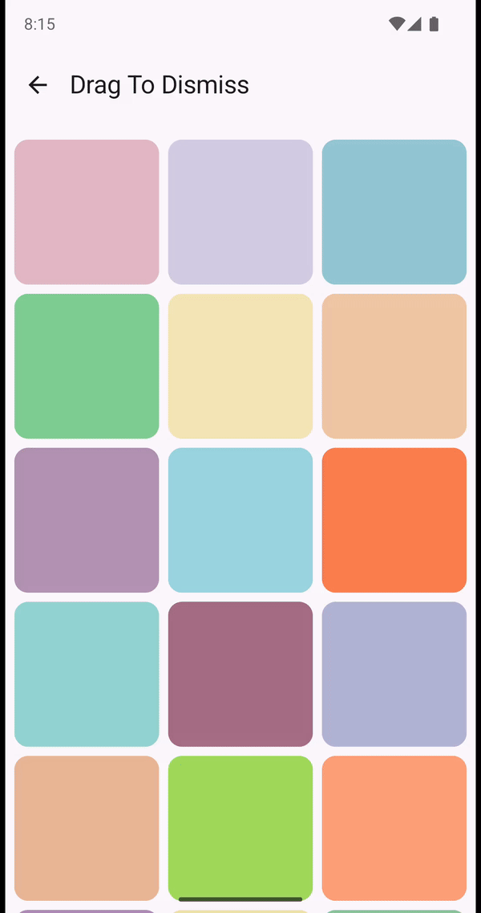

 # Drag To Dismiss

Used for easily implementing the drag to dismiss pattern for media.

```kotlin
@Composable
fun ParentLayout() {
    Child(
        modifier = Modifier
            .dragToDismiss(
                state = dragToDismissState,
                dragThresholdCheck = { offset, _ ->
                    offset.getDistanceSquared() > with(density) {
                        240.dp.toPx().let { it * it }
                    }
                },
                onDismissed = {
                    ...
                },
            )
    )
    ...
}
```


| Composable                        |                                                                                      |                                                                                                   |                                                                                            |
|-----------------------------------|--------------------------------------------------------------------------------------|---------------------------------------------------------------------------------------------------|--------------------------------------------------------------------------------------------|
| Drag To Dismiss                   |                       |                               |                        |
