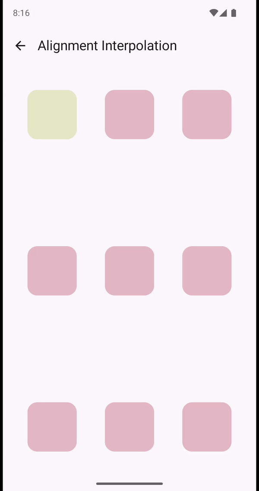
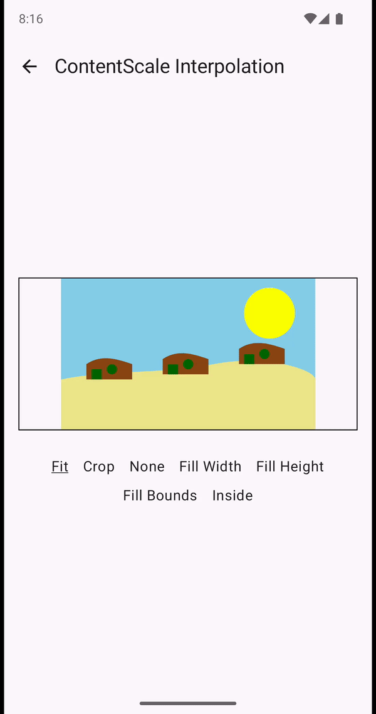

 # Interpolation

`Alignment` and `ContentScale` are used to help in the layout of composables, however it can be
necessary to interpolate between them when they change. `interpolate()` Composable extension
methods are added to help create a seamless transition.

```kotlin
@Composable
fun ParentLayout(
    contentScale: ContentScale,
    alignment: Alignment,
) {
    Image(
        painter = painter,
        contentScale = contentScale.interpolate(),
        alignment = alignment.interpolate(),
    )
    ...
}
```

| Composable                             |                                                                                          |                                                                                 |
|----------------------------------------|------------------------------------------------------------------------------------------|---------------------------------------------------------------------------------|
| Alignment / ContentScale Interpolation |              |  |                     