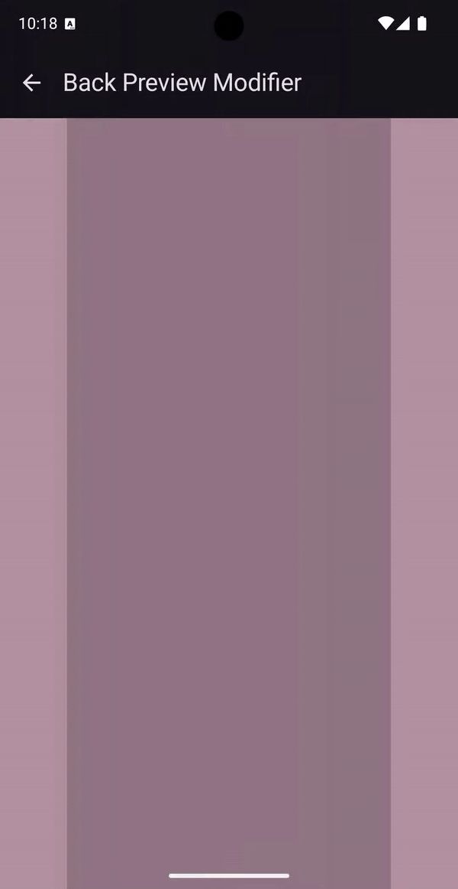
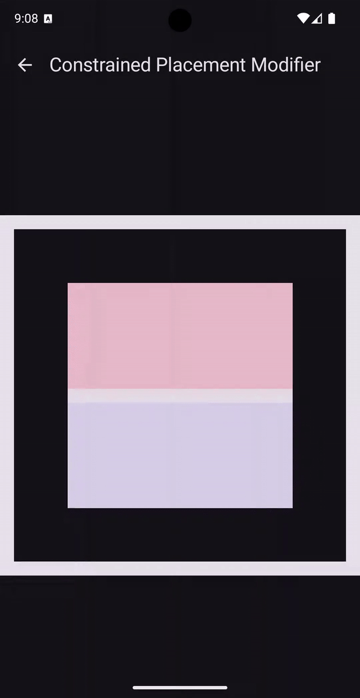

# Miscellaneous Modifiers

The library also offers miscellaneous modifiers for a myriad of use cases:

* `Modifier.backPreview`: An implementation of the [material back preview motion spec]( https://developer.android.com/design/ui/mobile/guides/patterns/predictive-back#motion-specs).
* `Modifier.constrainedSizePlacement`: Shifts layouts out of frame when placed in containers smaller than their minimum allowed size.

| Composable              |                                                   |                                                                       |                                                                       |
|-------------------------|---------------------------------------------------|-----------------------------------------------------------------------|-----------------------------------------------------------------------|
| Miscellaneous Modifiers |  |  |                                                                       |
