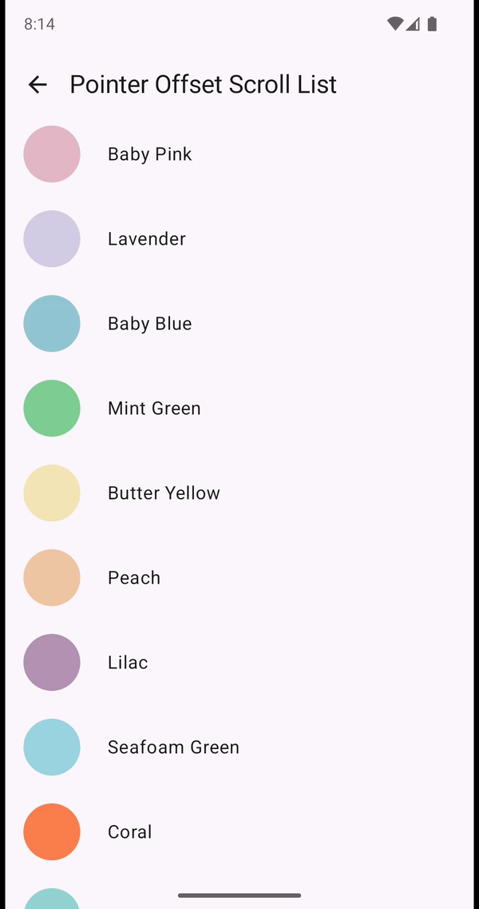
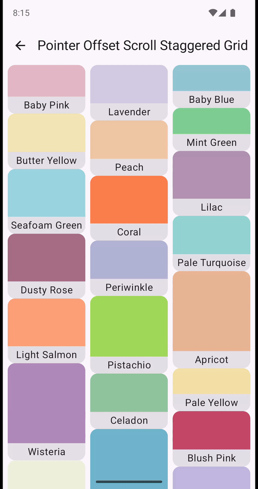

# Pointer Offset Scroll Header

Pointer offsets are useful for manually scrolling containers with [ScrollableState], when the
pointer is already involved in another interaction. For example drag and drop or a long press.

```kotlin
@Composable
fun Modifier.pointerOffsetScroll(
    state: PointerOffsetScrollState,
) {
    ...
}
```

| Composable            |                                                                          |                                                                          |                                                                                       |
|-----------------------|--------------------------------------------------------------------------|--------------------------------------------------------------------------|---------------------------------------------------------------------------------------|
| Pointer Offset Scroll |  |  |  |