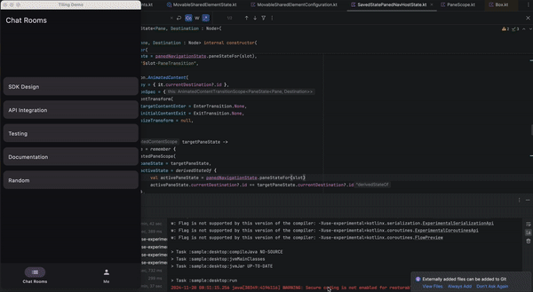
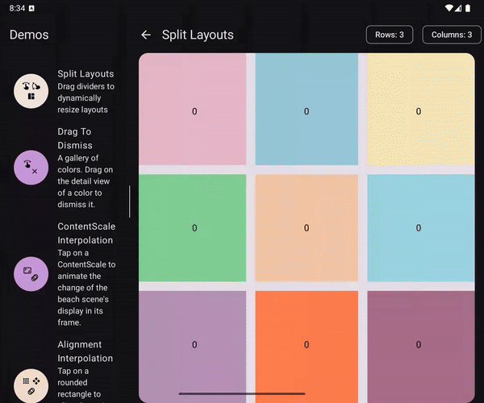

# Split Layouts

A `SplitLayout` is a weighted `Row` or `Column` that allows for multi-pane UX, like list detail
or three pane layouts. Pane display order can be changed without losing state by providing a
key for each pane using the `SplitLayoutState`.

```kotlin
@Composable
fun MultiPaneApp() {
    val panes = remember { 
        listOf(
            Primary,
            Secondary,
        )
    }
    val visiblePanes by remember {
        derivedStateOf {
            // Use window size to decide which panes are visible
        }
    }
    val splitLayoutState = remember {
        SplitLayoutState(
            orientation = Orientation.Horizontal,
            maxCount = panes.size,
            minSize = 120.dp,
            keyAtIndex = { index ->
                // Make sure regardless of visible panes, the right key is used
                val indexDiff = panes.size - visiblePanes.size
                panes[index + indexDiff]
            }
        )
    }
    SplitLayout(
        state = splitLayoutState,
        modifier = Modifier
            .fillMaxSize(),
        itemSeparators = { paneIndex, offset ->
            PaneSeparator(
                splitLayoutState = splitLayoutState,
                interactionSource = appState.paneInteractionSourceAt(paneIndex),
                index = paneIndex,
                xOffset = offset,
            )
        },
        itemContent = { index ->
            val pane = visiblePanes[index]
            Destination(pane)
        }
    )
}
```

| Composable    |                                                                  |                                                  |                                                                                       |
|---------------|------------------------------------------------------------------|--------------------------------------------------|---------------------------------------------------------------------------------------|
| Split Layouts |  |  |                                                                                       |