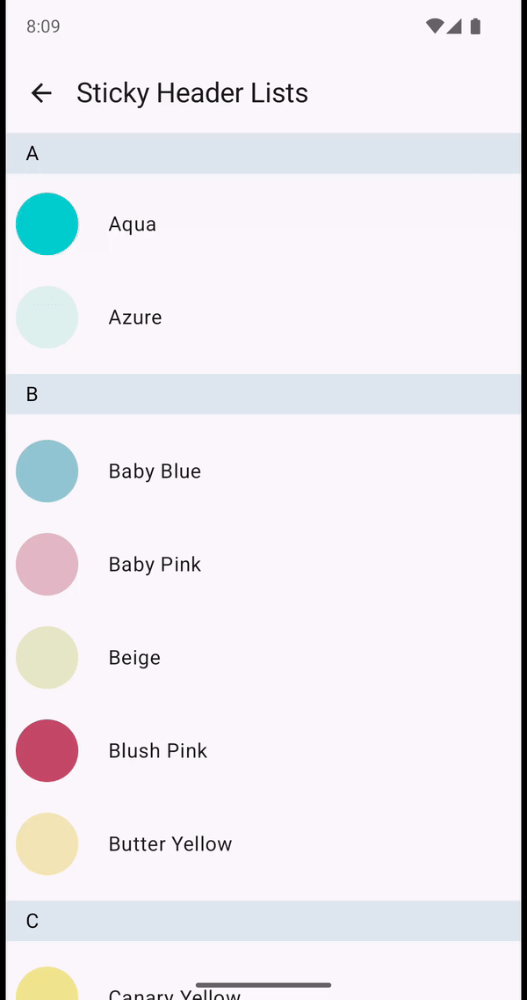
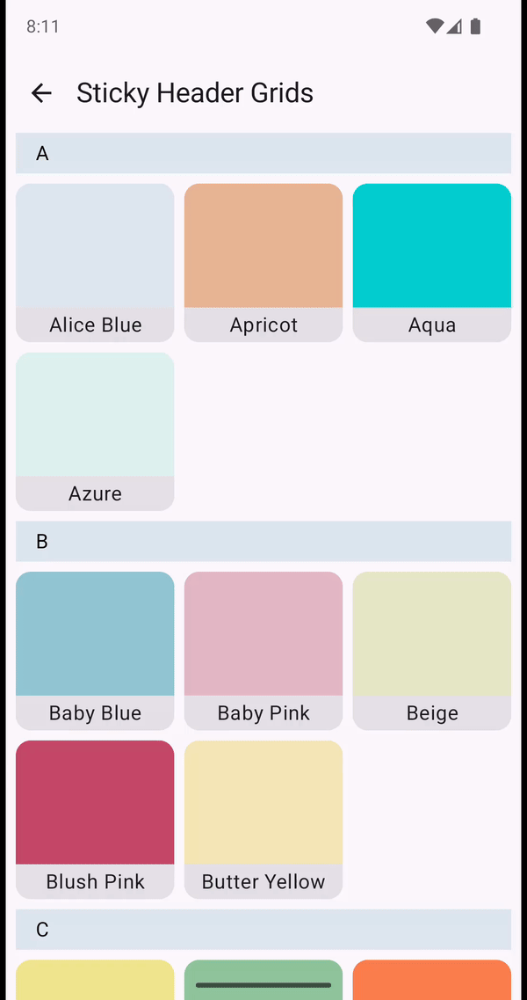
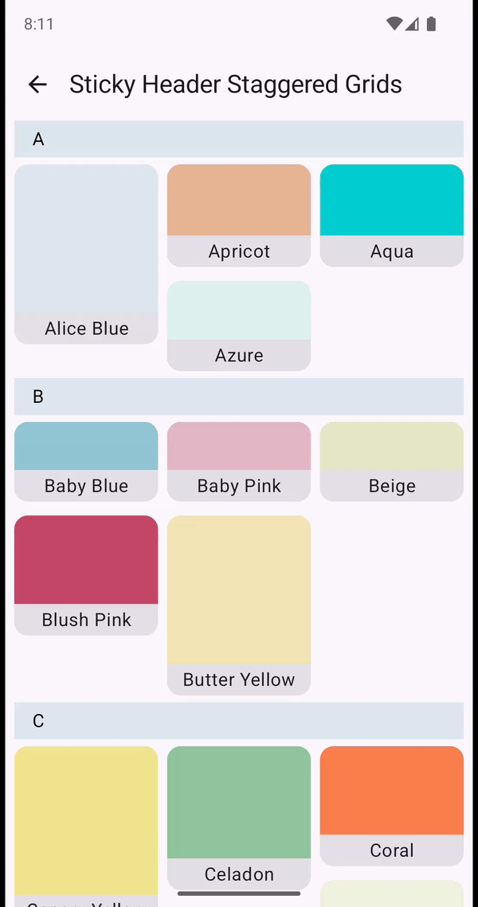

# Sticky Headers

Sticky headers in the library are achieved with a wrapping Composable enclosing the lazy layout.

```kotlin
@Composable
fun StickyHeader_(
    state: Lazy_State,
    modifier: Modifier = Modifier,
    isStickyHeaderItem: @DisallowComposableCalls (Lazy_ItemInfo) -> Boolean,
    stickyHeader: @Composable (index: Int, key: Any?, contentType: Any?) -> Unit,
    content: @Composable () -> Unit
) {
    ...
}
```

They are implemented for lists, grids and staggered grids.

| Composable                        |                                                   |                                                   |                                                                       |
|-----------------------------------|---------------------------------------------------|---------------------------------------------------|-----------------------------------------------------------------------|
| Sticky Headers                    |  |  |  |
