# Composables

![badge][badge-ios]
![badge][badge-js]
![badge][badge-jvm]

Please note, this is an experimental repository. It is a Kotlin multiplatform experiment that makes
no guarantees
about API stability or long term support. None of the works presented here are production tested,
and should not be
taken as anything more than its face value.

## Introduction

Composables are a collection of utility methods that build on the Jetpack Compose UI and Foundation
packages.

They offer APIs for common UI interactions that make UI more delightful. They are summarize below

| Composable                             |                                                                                                           |                                                                                                           |                                                                                                                             |
|----------------------------------------|-----------------------------------------------------------------------------------------------------------|-----------------------------------------------------------------------------------------------------------|-----------------------------------------------------------------------------------------------------------------------------|
| Split Layouts                          | 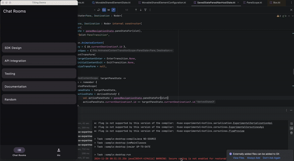                                         | 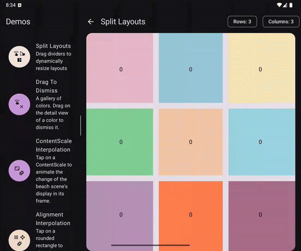                                                         |                                                                                                                             |
| Sticky Headers                         | 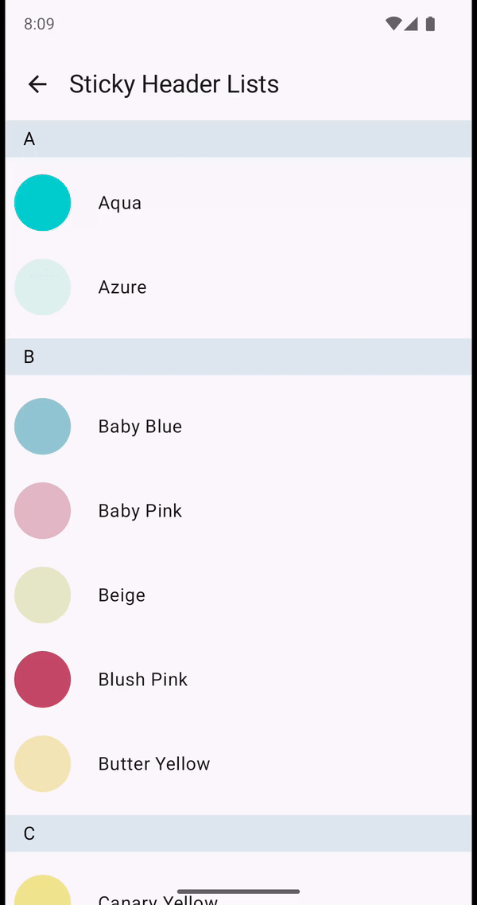                                                        | 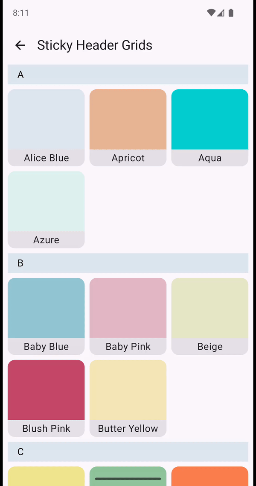                                                        | 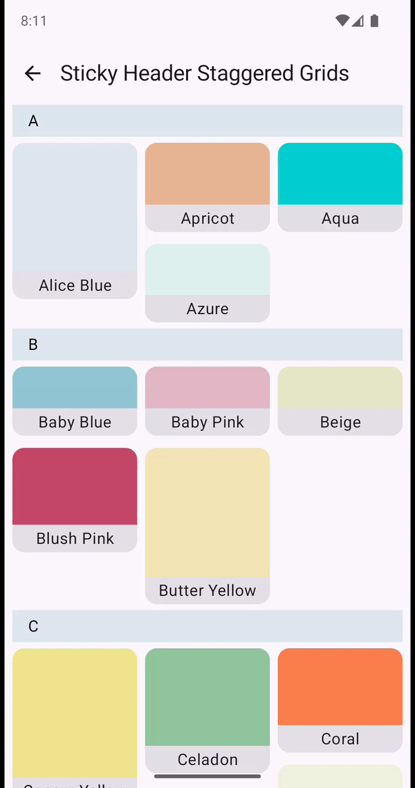                                                      |
| Collapsing Headers and Scrollbars      | 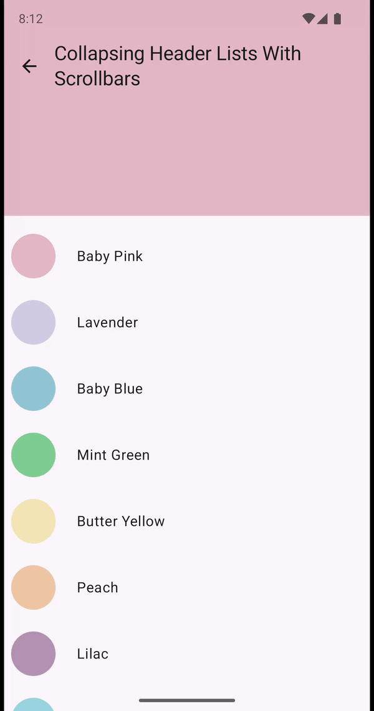 |  |  |
| Pointer Offset Scroll                  | 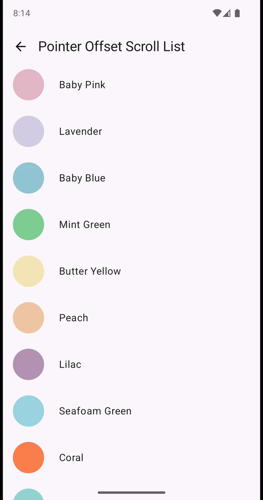                                 | 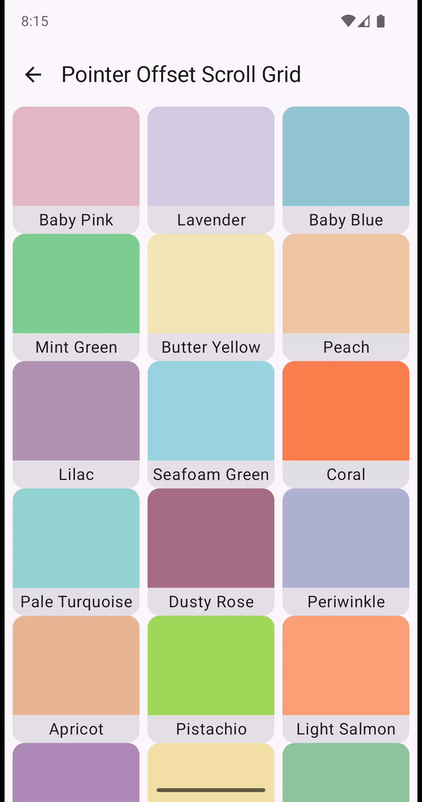                                 | 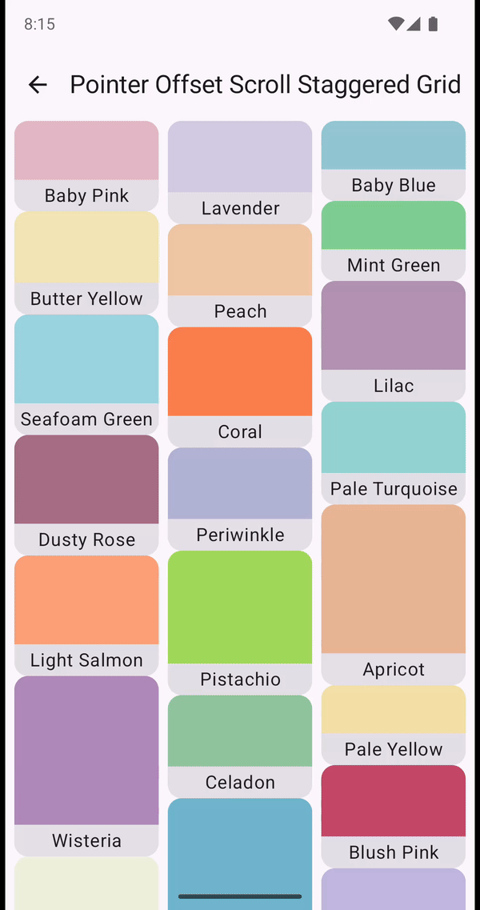                                      |
| Drag To Dismiss                        | 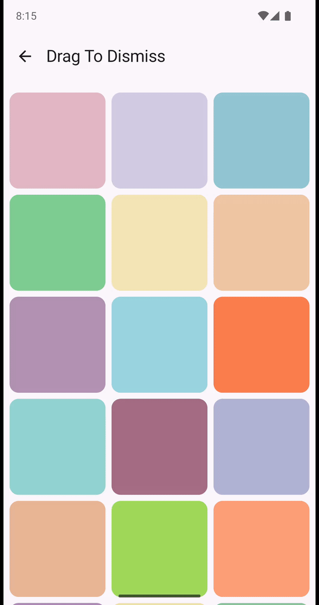                                          |                                      |                                                        |
| Alignment / ContentScale Interpolation | 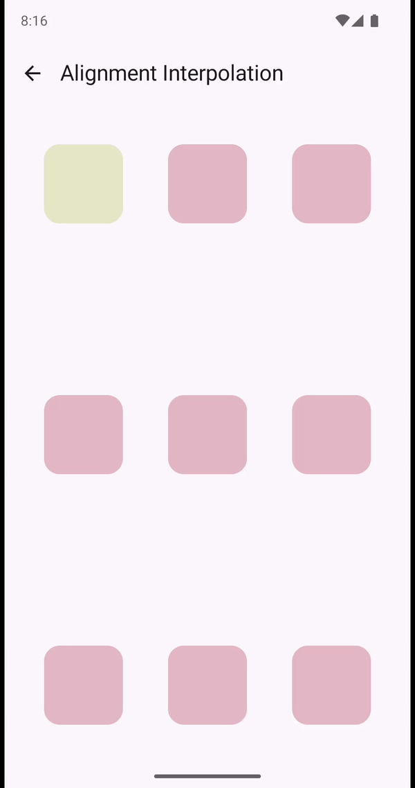                             | 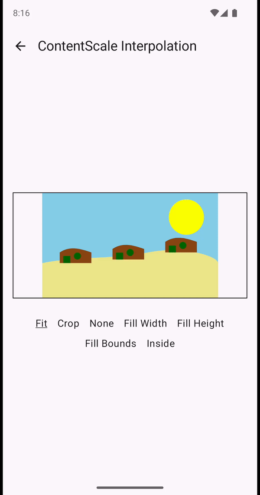                          |                                                                                                                             |

Please see the [documentation](https://tunjid.github.io/composables/) for more details.

## License

    Copyright 2023 Adetunji Dahunsi

    Licensed under the Apache License, Version 2.0 (the "License");
    you may not use this file except in compliance with the License.
    You may obtain a copy of the License at

        https://www.apache.org/licenses/LICENSE-2.0

    Unless required by applicable law or agreed to in writing, software
    distributed under the License is distributed on an "AS IS" BASIS,
    WITHOUT WARRANTIES OR CONDITIONS OF ANY KIND, either express or implied.
    See the License for the specific language governing permissions and
    limitations under the License.

[badge-android]: http://img.shields.io/badge/-android-6EDB8D.svg?style=flat

[badge-jvm]: http://img.shields.io/badge/-jvm-DB413D.svg?style=flat

[badge-js]: http://img.shields.io/badge/-js-F8DB5D.svg?style=flat

[badge-js-ir]: https://img.shields.io/badge/support-[IR]-AAC4E0.svg?style=flat

[badge-nodejs]: https://img.shields.io/badge/-nodejs-68a063.svg?style=flat

[badge-linux]: http://img.shields.io/badge/-linux-2D3F6C.svg?style=flat

[badge-windows]: http://img.shields.io/badge/-windows-4D76CD.svg?style=flat

[badge-wasm]: https://img.shields.io/badge/-wasm-624FE8.svg?style=flat

[badge-apple-silicon]: http://img.shields.io/badge/support-[AppleSilicon]-43BBFF.svg?style=flat

[badge-ios]: http://img.shields.io/badge/-ios-CDCDCD.svg?style=flat

[badge-mac]: http://img.shields.io/badge/-macos-111111.svg?style=flat

[badge-watchos]: http://img.shields.io/badge/-watchos-C0C0C0.svg?style=flat

[badge-tvos]: http://img.shields.io/badge/-tvos-808080.svg?style=flat
